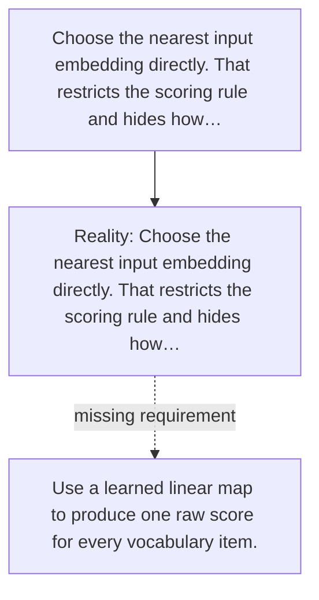

# Diagram — Excavation 041 — Logits — Let Every Vocabulary Token Compete

The picture carries this excavation's particular counterexample and repair.



```text
TRY     Choose the nearest input embedding directly. That restricts the scoring rule and hides how…
BREAK   Choose the nearest input embedding directly. That restricts the scoring rule and hides how…
REPAIR  Use a learned linear map to produce one raw score for every vocabulary item.
```
