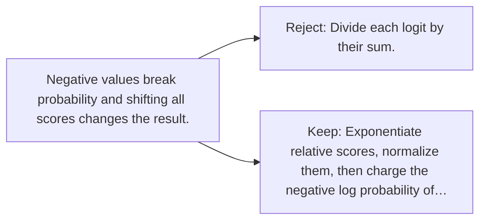

# Diagram — Excavation 042 — Vocabulary Probabilities — Turning Scores into a Prediction

The picture carries this excavation's particular counterexample and repair.



```text
TRY     Divide each logit by their sum.
BREAK   Negative values break probability and shifting all scores changes the result.
REPAIR  Exponentiate relative scores, normalize them, then charge the negative log probability of…
```
