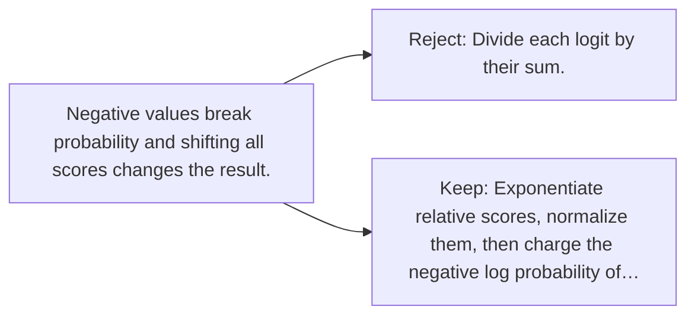

# Diagram — Excavation 042 — Vocabulary Probabilities — Turning Scores into a Prediction

The picture carries this excavation's particular counterexample and repair.



```text
TRY     Divide each logit by their sum.
BREAK   Negative values break probability and shifting all scores changes the result.
REPAIR  Exponentiate relative scores, normalize them, then charge the negative log probability of…
```

<!-- memory-film-v1:start -->
## Five-frame memory film

```text
QUESTION       What fails if we divide each logit by their sum?
     ↓
OBJECT         the vocabulary probabilities gate mounted on the sentence-wheel
     ↓
VISIBLE BREAK  The gate follows the tempting path—divide each logit by their sum. Then the evidence answers: negative values break probability and shifting all scores changes the result.
     ↓
TRANSFORMATION The mechanist changes one moving part. The gate can now exponentiate relative scores, normalize them, then charge the negative log probability of the observed next token.
     ↓
MEMORY SEAL    Vocabulary Probabilities keeps the missing power: exponentiate relative scores, normalize them, then charge the negative log probability of the observed next token.
```
<!-- memory-film-v1:end -->
