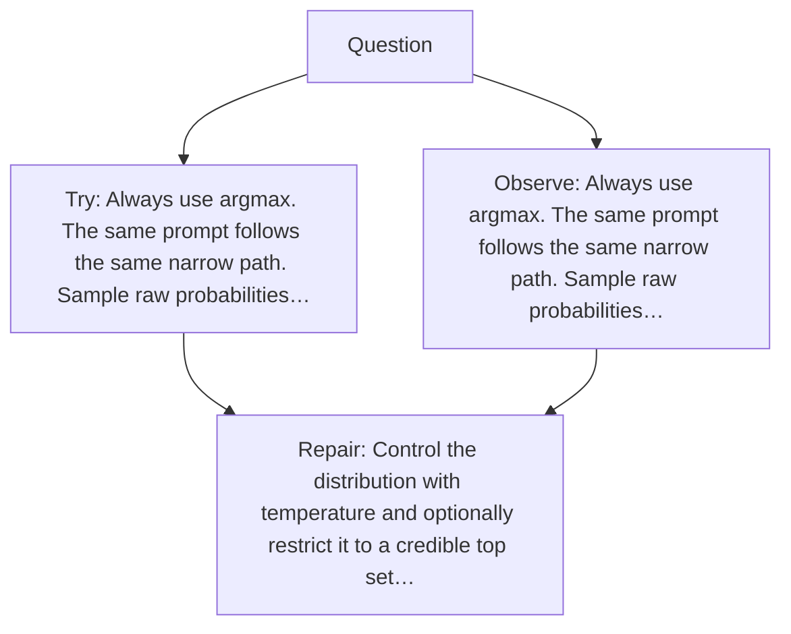

# Diagram — Excavation 043 — Sampling — Choosing Without Always Taking the Maximum

The picture carries this excavation's particular counterexample and repair.



```text
TRY     Always use argmax. The same prompt follows the same narrow path. Sample raw probabilities…
BREAK   Always use argmax. The same prompt follows the same narrow path. Sample raw probabilities…
REPAIR  Control the distribution with temperature and optionally restrict it to a credible top set…
```
