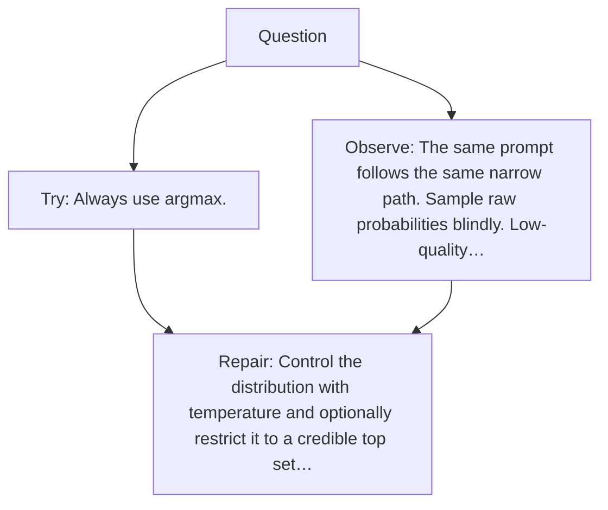

# Diagram — Excavation 043 — Sampling — Choosing Without Always Taking the Maximum

The picture carries this excavation's particular counterexample and repair.



```text
TRY     Always use argmax.
BREAK   The same prompt follows the same narrow path. Sample raw probabilities blindly. Low-quality…
REPAIR  Control the distribution with temperature and optionally restrict it to a credible top set…
```

<!-- memory-film-v1:start -->
## Five-frame memory film

```text
QUESTION       What fails if we always use argmax?
     ↓
OBJECT         the sampling wheel mounted on the sentence-wheel
     ↓
VISIBLE BREAK  The wheel follows the tempting path—always use argmax. Then the evidence answers: the same prompt follows the same narrow path. Sample raw probabilities blindly. Low-quality tail tokens eventually derail the text.
     ↓
TRANSFORMATION The mechanist changes one moving part. The wheel can now control the distribution with temperature and optionally restrict it to a credible top set before sampling.
     ↓
MEMORY SEAL    Sampling keeps the missing power: control the distribution with temperature and optionally restrict it to a credible top set before sampling.
```
<!-- memory-film-v1:end -->
