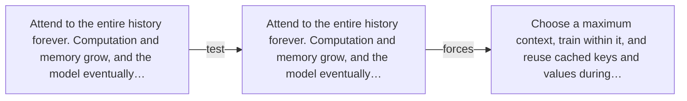

# Diagram — Excavation 044 — Context Windows — How Much Past Can the Model Carry?

The picture carries this excavation's particular counterexample and repair.



```text
TRY     Attend to the entire history forever. Computation and memory grow, and the model eventually…
BREAK   Attend to the entire history forever. Computation and memory grow, and the model eventually…
REPAIR  Choose a maximum context, train within it, and reuse cached keys and values during…
```
