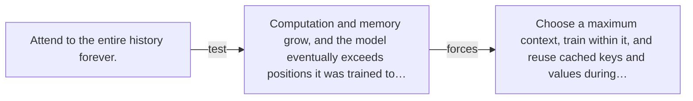

# Diagram — Excavation 044 — Context Windows — How Much Past Can the Model Carry?

The picture carries this excavation's particular counterexample and repair.



```text
TRY     Attend to the entire history forever.
BREAK   Computation and memory grow, and the model eventually exceeds positions it was trained to…
REPAIR  Choose a maximum context, train within it, and reuse cached keys and values during…
```

<!-- memory-film-v1:start -->
## Five-frame memory film

```text
QUESTION       How Much Past Can the Model Carry?
     ↓
OBJECT         the context windows map mounted on the sentence-wheel
     ↓
VISIBLE BREAK  The map follows the tempting path—attend to the entire history forever. Then the evidence answers: computation and memory grow, and the model eventually exceeds positions it was trained to handle.
     ↓
TRANSFORMATION The mechanist changes one moving part. The map can now choose a maximum context, train within it, and reuse cached keys and values during generation instead of recomputing the unchanged past.
     ↓
MEMORY SEAL    Context Windows keeps the missing power: choose a maximum context, train within it, and reuse cached keys and values during generation instead of recomputing the unchanged past.
```
<!-- memory-film-v1:end -->
