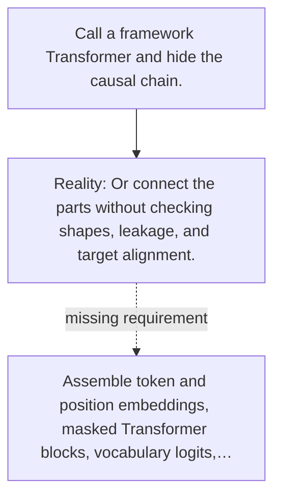

# Diagram — Excavation 045 — A Tiny GPT — Close the Prediction Loop

The picture carries this excavation's particular counterexample and repair.



```text
TRY     Call a framework Transformer and hide the causal chain.
BREAK   Or connect the parts without checking shapes, leakage, and target alignment.
REPAIR  Assemble token and position embeddings, masked Transformer blocks, vocabulary logits,…
```

<!-- memory-film-v1:start -->
## Five-frame memory film

```text
QUESTION       What fails if we call a framework Transformer and hide the causal chain?
     ↓
OBJECT         the tiny gpt scale mounted on the sentence-wheel
     ↓
VISIBLE BREAK  The scale follows the tempting path—call a framework Transformer and hide the causal chain. Then the evidence answers: or connect the parts without checking shapes, leakage, and target alignment.
     ↓
TRANSFORMATION The mechanist changes one moving part. The scale can now assemble token and position embeddings, masked Transformer blocks, vocabulary logits, cross-entropy training, and iterative sampling in one traceable program.
     ↓
MEMORY SEAL    A Tiny GPT keeps the missing power: assemble token and position embeddings, masked Transformer blocks, vocabulary logits, cross-entropy training, and iterative sampling in one traceable program.
```
<!-- memory-film-v1:end -->
