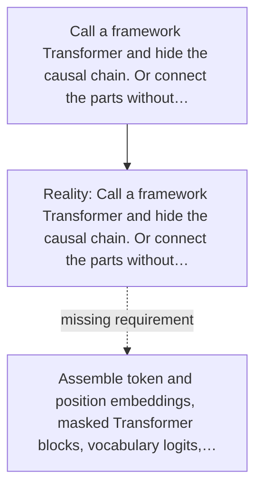

# Diagram — Excavation 045 — A Tiny GPT — Close the Prediction Loop

The picture carries this excavation's particular counterexample and repair.



```text
TRY     Call a framework Transformer and hide the causal chain. Or connect the parts without…
BREAK   Call a framework Transformer and hide the causal chain. Or connect the parts without…
REPAIR  Assemble token and position embeddings, masked Transformer blocks, vocabulary logits,…
```
