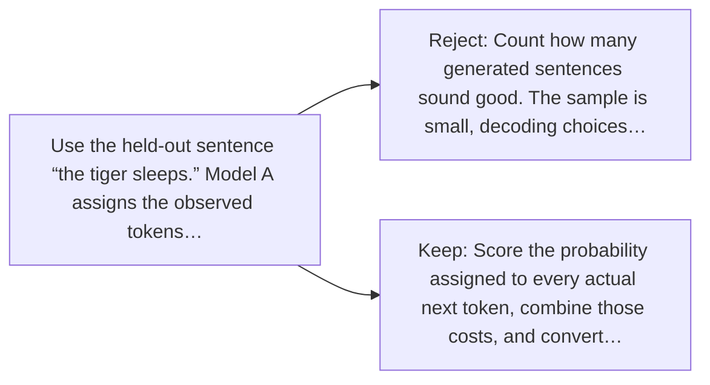

# Diagram — Excavation 046 — Perplexity — How Surprised Is the Model?

The picture carries this excavation's particular counterexample and repair.



```text
TRY     Count how many generated sentences sound good. The sample is small, decoding choices…
BREAK   Use the held-out sentence “the tiger sleeps.” Model A assigns the observed tokens…
REPAIR  Score the probability assigned to every actual next token, combine those costs, and convert…
```
