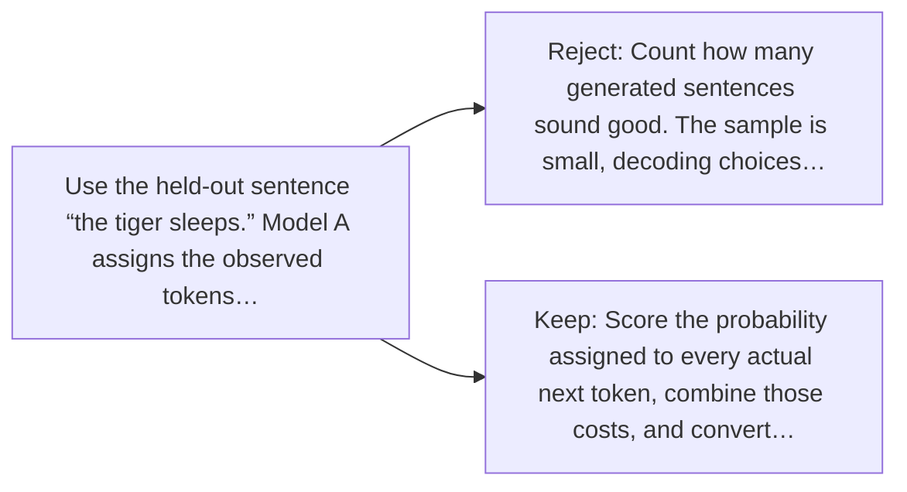

# Diagram — Excavation 046 — Perplexity — How Surprised Is the Model?

The picture carries this excavation's particular counterexample and repair.



```text
TRY     Count how many generated sentences sound good. The sample is small, decoding choices…
BREAK   Use the held-out sentence “the tiger sleeps.” Model A assigns the observed tokens…
REPAIR  Score the probability assigned to every actual next token, combine those costs, and convert…
```

<!-- memory-film-v1:start -->
## Five-frame memory film

```text
QUESTION       How Surprised Is the Model?
     ↓
OBJECT         the perplexity gear mounted on the listening table
     ↓
VISIBLE BREAK  The gear follows the tempting path—count how many generated sentences sound good. The sample is small, decoding choices interfere, and two people may disagree. Then the evidence answers: the held-out sentence “the tiger sleeps” reveals the weakness. Model A assigns the observed tokens probabilities 0.5, 0.5, and 0.5; Model B assigns 0.9, 0.1, and 0.9. A few attractive samples cannot expose B’s severe surprise at the middle token.
     ↓
TRANSFORMATION The public archivist changes one moving part. The gear can now score the probability assigned to every actual next token, combine those costs, and convert the average back into an intuitive “equally likely choices” scale.
     ↓
MEMORY SEAL    Perplexity keeps the missing power: score the probability assigned to every actual next token, combine those costs, and convert the average back into an intuitive “equally likely choices” scale.
```
<!-- memory-film-v1:end -->
