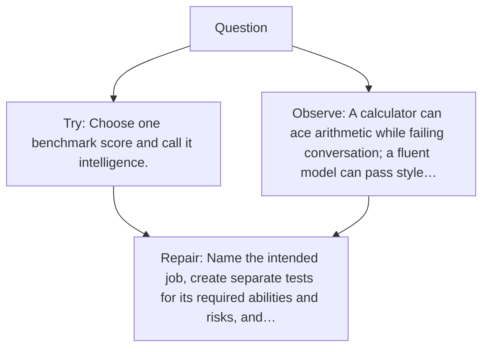

# Diagram — Excavation 047 — Evaluation — What Does “Better” Actually Mean?

The picture carries this excavation's particular counterexample and repair.



```text
TRY     Choose one benchmark score and call it intelligence.
BREAK   A calculator can ace arithmetic while failing conversation; a fluent model can pass style…
REPAIR  Name the intended job, create separate tests for its required abilities and risks, and…
```
