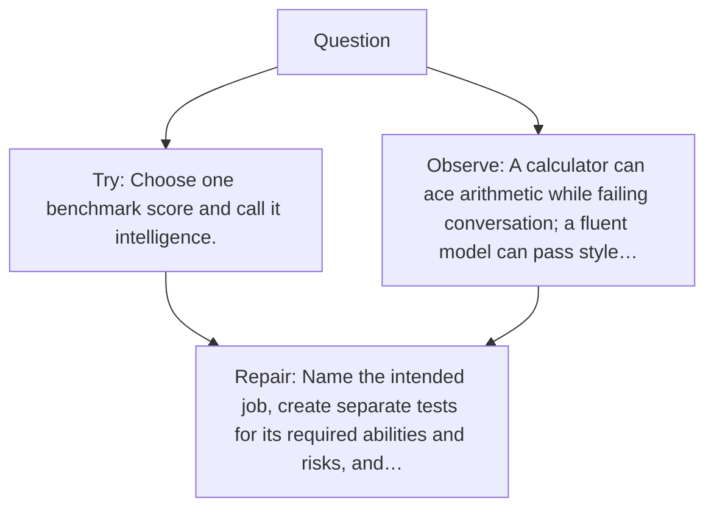

# Diagram — Excavation 047 — Evaluation — What Does “Better” Actually Mean?

The picture carries this excavation's particular counterexample and repair.



```text
TRY     Choose one benchmark score and call it intelligence.
BREAK   A calculator can ace arithmetic while failing conversation; a fluent model can pass style…
REPAIR  Name the intended job, create separate tests for its required abilities and risks, and…
```

<!-- memory-film-v1:start -->
## Five-frame memory film

```text
QUESTION       What Does “Better” Actually Mean?
     ↓
OBJECT         the evaluation prism mounted on the listening table
     ↓
VISIBLE BREAK  The prism follows the tempting path—choose one benchmark score and call it intelligence. Then the evidence answers: the trouble appears immediately: a calculator can ace arithmetic while failing conversation; a fluent model can pass style tests while inventing facts. One number silently chooses which failures do not matter.
     ↓
TRANSFORMATION The public archivist changes one moving part. The prism can now name the intended job, create separate tests for its required abilities and risks, and inspect real failures rather than averaging them away.
     ↓
MEMORY SEAL    Evaluation keeps the missing power: name the intended job, create separate tests for its required abilities and risks, and inspect real failures rather than averaging them away.
```
<!-- memory-film-v1:end -->
