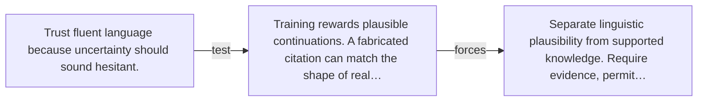

# Diagram — Excavation 048 — Hallucination — When Fluent Prediction Outruns Evidence

The picture carries this excavation's particular counterexample and repair.



```text
TRY     Trust fluent language because uncertainty should sound hesitant.
BREAK   Training rewards plausible continuations. A fabricated citation can match the shape of real…
REPAIR  Separate linguistic plausibility from supported knowledge. Require evidence, permit…
```
