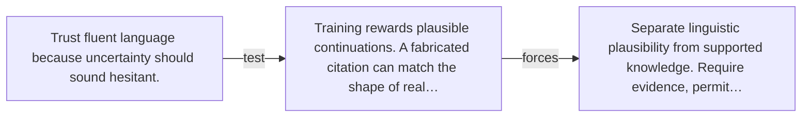

# Diagram — Excavation 048 — Hallucination — When Fluent Prediction Outruns Evidence

The picture carries this excavation's particular counterexample and repair.



```text
TRY     Trust fluent language because uncertainty should sound hesitant.
BREAK   Training rewards plausible continuations. A fabricated citation can match the shape of real…
REPAIR  Separate linguistic plausibility from supported knowledge. Require evidence, permit…
```

<!-- memory-film-v1:start -->
## Five-frame memory film

```text
QUESTION       When Fluent Prediction Outruns Evidence?
     ↓
OBJECT         the hallucination seal mounted on the listening table
     ↓
VISIBLE BREAK  The seal follows the tempting path—trust fluent language because uncertainty should sound hesitant. Then the evidence answers: training rewards plausible continuations. A fabricated citation can match the shape of real citations and therefore sound more natural than “I do not know.”.
     ↓
TRANSFORMATION The public archivist changes one moving part. The seal can now separate linguistic plausibility from supported knowledge. Require evidence, permit abstention, and test whether claims can be traced to an available source.
     ↓
MEMORY SEAL    Hallucination keeps the missing power: separate linguistic plausibility from supported knowledge. Require evidence, permit abstention, and test whether claims can be traced to an available source.
```
<!-- memory-film-v1:end -->
