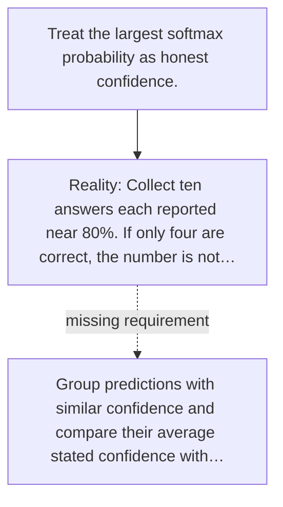

# Diagram — Excavation 049 — Calibration — Does 80% Confidence Mean Eight Out of Ten?

The picture carries this excavation's particular counterexample and repair.



```text
TRY     Treat the largest softmax probability as honest confidence.
BREAK   Collect ten answers each reported near 80%. If only four are correct, the number is not…
REPAIR  Group predictions with similar confidence and compare their average stated confidence with…
```

<!-- memory-film-v1:start -->
## Five-frame memory film

```text
QUESTION       What fails if we treat the largest softmax probability as honest confidence?
     ↓
OBJECT         the calibration lens mounted on the listening table
     ↓
VISIBLE BREAK  The lens follows the tempting path—treat the largest softmax probability as honest confidence. Then the evidence answers: collect ten answers each reported near 80%. If only four are correct, the number is not describing observed reliability.
     ↓
TRANSFORMATION The public archivist changes one moving part. The lens can now group predictions with similar confidence and compare their average stated confidence with the fraction actually correct.
     ↓
MEMORY SEAL    Calibration keeps the missing power: group predictions with similar confidence and compare their average stated confidence with the fraction actually correct.
```
<!-- memory-film-v1:end -->
