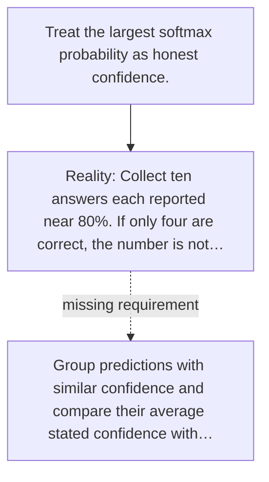

# Diagram — Excavation 049 — Calibration — Does 80% Confidence Mean Eight Out of Ten?

The picture carries this excavation's particular counterexample and repair.



```text
TRY     Treat the largest softmax probability as honest confidence.
BREAK   Collect ten answers each reported near 80%. If only four are correct, the number is not…
REPAIR  Group predictions with similar confidence and compare their average stated confidence with…
```
