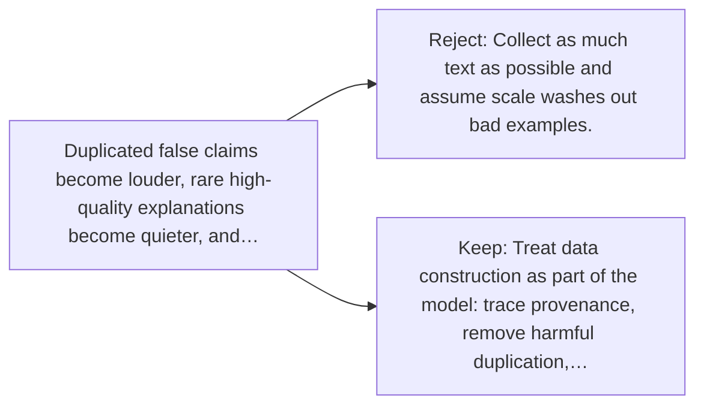

# Diagram — Excavation 050 — Data Quality — What Lessons Did the Model Actually Receive?

The picture carries this excavation's particular counterexample and repair.



```text
TRY     Collect as much text as possible and assume scale washes out bad examples.
BREAK   Duplicated false claims become louder, rare high-quality explanations become quieter, and…
REPAIR  Treat data construction as part of the model: trace provenance, remove harmful duplication,…
```
