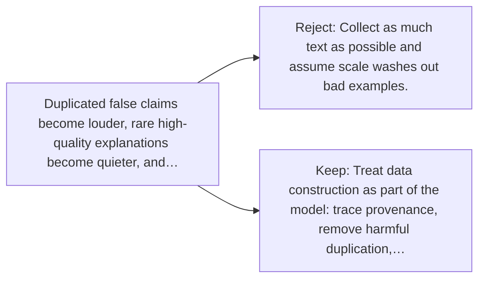

# Diagram — Excavation 050 — Data Quality — What Lessons Did the Model Actually Receive?

The picture carries this excavation's particular counterexample and repair.



```text
TRY     Collect as much text as possible and assume scale washes out bad examples.
BREAK   Duplicated false claims become louder, rare high-quality explanations become quieter, and…
REPAIR  Treat data construction as part of the model: trace provenance, remove harmful duplication,…
```

<!-- memory-film-v1:start -->
## Five-frame memory film

```text
QUESTION       What Lessons Did the Model Actually Receive?
     ↓
OBJECT         the data quality key mounted on the listening table
     ↓
VISIBLE BREAK  The key follows the tempting path—collect as much text as possible and assume scale washes out bad examples. Then the evidence answers: duplicated false claims become louder, rare high-quality explanations become quieter, and sensitive records remain memorized. More observations amplify whatever process produced them.
     ↓
TRANSFORMATION The public archivist changes one moving part. The key can now treat data construction as part of the model: trace provenance, remove harmful duplication, filter carefully, preserve valuable diversity, and document choices.
     ↓
MEMORY SEAL    Data Quality keeps the missing power: treat data construction as part of the model: trace provenance, remove harmful duplication, filter carefully, preserve valuable diversity, and document choices.
```
<!-- memory-film-v1:end -->
