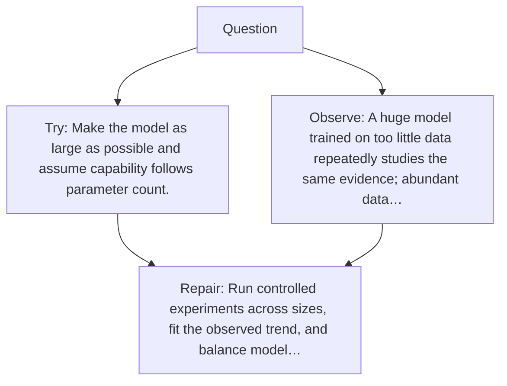

# Diagram — Excavation 051 — Scaling Laws — What Improves When We Add More?

The picture carries this excavation's particular counterexample and repair.



```text
TRY     Make the model as large as possible and assume capability follows parameter count.
BREAK   A huge model trained on too little data repeatedly studies the same evidence; abundant data…
REPAIR  Run controlled experiments across sizes, fit the observed trend, and balance model…
```
