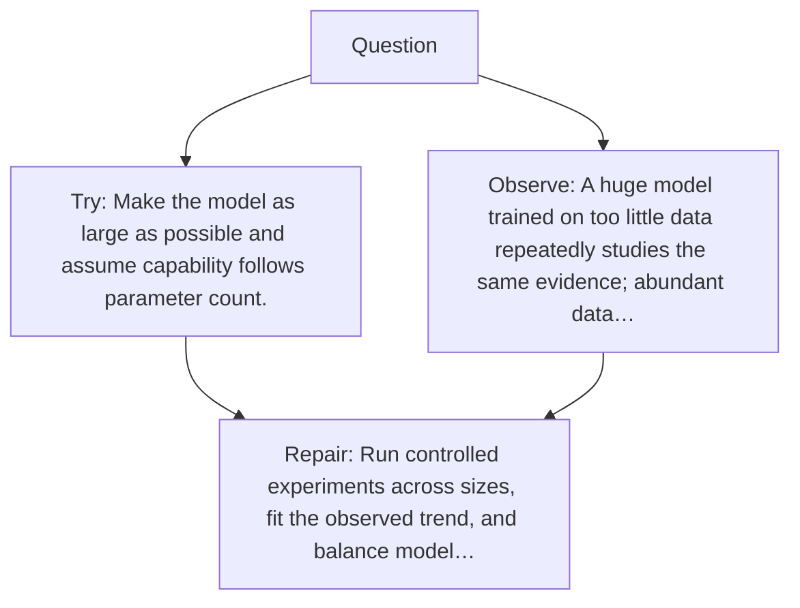

# Diagram — Excavation 051 — Scaling Laws — What Improves When We Add More?

The picture carries this excavation's particular counterexample and repair.



```text
TRY     Make the model as large as possible and assume capability follows parameter count.
BREAK   A huge model trained on too little data repeatedly studies the same evidence; abundant data…
REPAIR  Run controlled experiments across sizes, fit the observed trend, and balance model…
```

<!-- memory-film-v1:start -->
## Five-frame memory film

```text
QUESTION       What Improves When We Add More?
     ↓
OBJECT         the scaling laws lantern mounted on the listening table
     ↓
VISIBLE BREAK  The lantern follows the tempting path—make the model as large as possible and assume capability follows parameter count. Then the evidence answers: a huge model trained on too little data repeatedly studies the same evidence; abundant data cannot help a model too small to compress its patterns.
     ↓
TRANSFORMATION The public archivist changes one moving part. The lantern can now run controlled experiments across sizes, fit the observed trend, and balance model capacity, data, and compute rather than worship one number.
     ↓
MEMORY SEAL    Scaling Laws keeps the missing power: run controlled experiments across sizes, fit the observed trend, and balance model capacity, data, and compute rather than worship one number.
```
<!-- memory-film-v1:end -->
