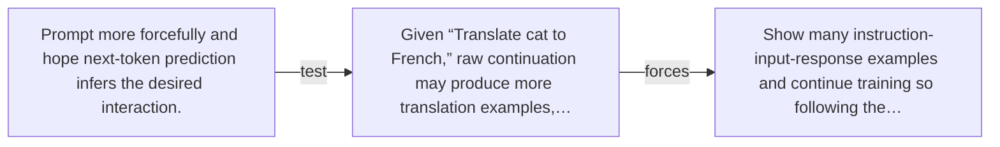

# Diagram — Excavation 052 — Instruction Tuning — From Continuation to Cooperation

The picture carries this excavation's particular counterexample and repair.



```text
TRY     Prompt more forcefully and hope next-token prediction infers the desired interaction.
BREAK   Given “Translate cat to French,” raw continuation may produce more translation examples,…
REPAIR  Show many instruction-input-response examples and continue training so following the…
```
