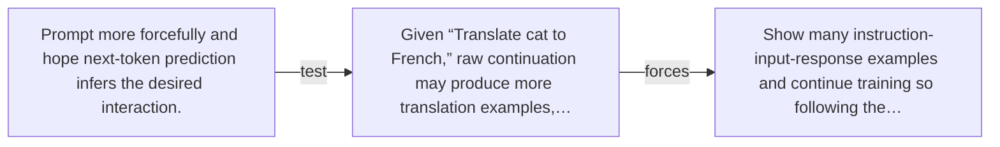

# Diagram — Excavation 052 — Instruction Tuning — From Continuation to Cooperation

The picture carries this excavation's particular counterexample and repair.



```text
TRY     Prompt more forcefully and hope next-token prediction infers the desired interaction.
BREAK   Given “Translate cat to French,” raw continuation may produce more translation examples,…
REPAIR  Show many instruction-input-response examples and continue training so following the…
```

<!-- memory-film-v1:start -->
## Five-frame memory film

```text
QUESTION       What fails if we prompt more forcefully and hope next-token prediction infers the desired interaction?
     ↓
OBJECT         the instruction tuning compass mounted on the listening table
     ↓
VISIBLE BREAK  The compass follows the tempting path—prompt more forcefully and hope next-token prediction infers the desired interaction. Then the evidence answers: the trouble appears immediately: given “Translate cat to French,” raw continuation may produce more translation examples, commentary, or unrelated web text. Pretraining learned many formats, not one cooperative policy.
     ↓
TRANSFORMATION The public archivist changes one moving part. The compass can now show many instruction-input-response examples and continue training so following the requested task becomes a reusable pattern.
     ↓
MEMORY SEAL    Instruction Tuning keeps the missing power: show many instruction-input-response examples and continue training so following the requested task becomes a reusable pattern.
```
<!-- memory-film-v1:end -->
