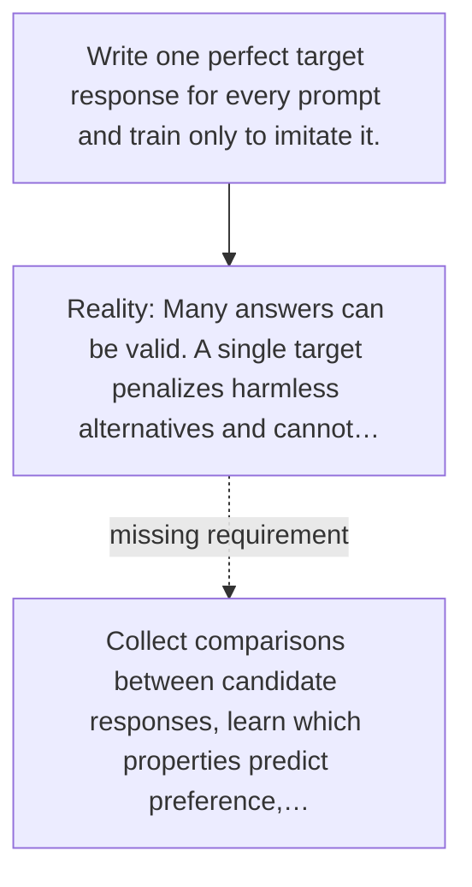

# Diagram — Excavation 053 — Preference Learning — When Several Answers Are Correct but Not Equally Helpful

The picture carries this excavation's particular counterexample and repair.



```text
TRY     Write one perfect target response for every prompt and train only to imitate it.
BREAK   Many answers can be valid. A single target penalizes harmless alternatives and cannot…
REPAIR  Collect comparisons between candidate responses, learn which properties predict preference,…
```

<!-- memory-film-v1:start -->
## Five-frame memory film

```text
QUESTION       When Several Answers Are Correct but Not Equally Helpful?
     ↓
OBJECT         the preference learning bridge mounted on the listening table
     ↓
VISIBLE BREAK  The bridge follows the tempting path—write one perfect target response for every prompt and train only to imitate it. Then the evidence answers: many answers can be valid. A single target penalizes harmless alternatives and cannot express that answer A is preferred to B without being the only possible answer.
     ↓
TRANSFORMATION The public archivist changes one moving part. The bridge can now collect comparisons between candidate responses, learn which properties predict preference, and use that signal to improve the response policy.
     ↓
MEMORY SEAL    Preference Learning keeps the missing power: collect comparisons between candidate responses, learn which properties predict preference, and use that signal to improve the response policy.
```
<!-- memory-film-v1:end -->
