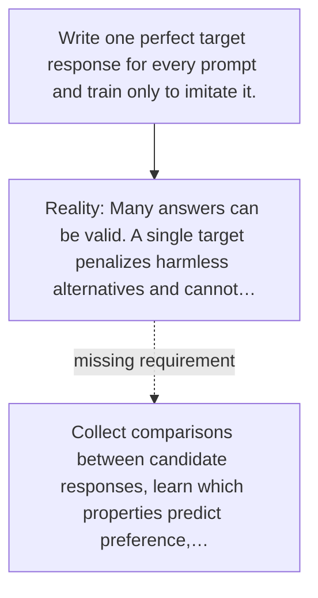

# Diagram — Excavation 053 — Preference Learning — When Several Answers Are Correct but Not Equally Helpful

The picture carries this excavation's particular counterexample and repair.



```text
TRY     Write one perfect target response for every prompt and train only to imitate it.
BREAK   Many answers can be valid. A single target penalizes harmless alternatives and cannot…
REPAIR  Collect comparisons between candidate responses, learn which properties predict preference,…
```
