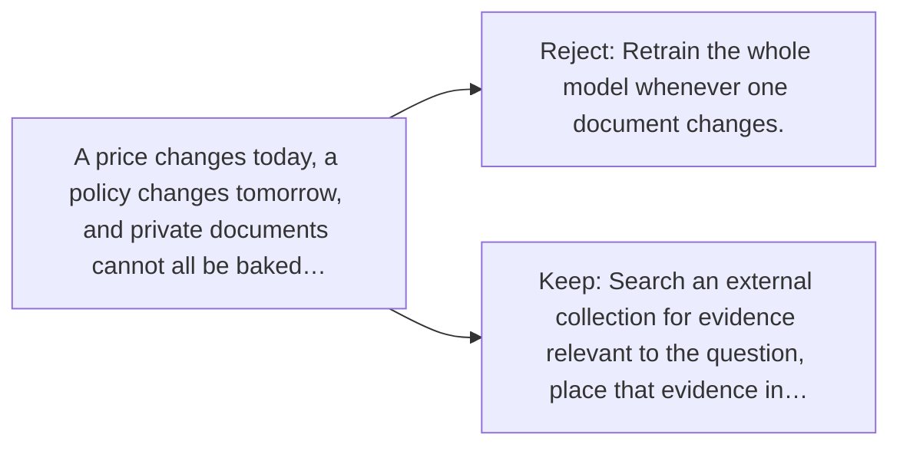

# Diagram — Excavation 054 — Retrieval-Augmented Generation — Let the Model Look Before It Speaks

The picture carries this excavation's particular counterexample and repair.



```text
TRY     Retrain the whole model whenever one document changes.
BREAK   A price changes today, a policy changes tomorrow, and private documents cannot all be baked…
REPAIR  Search an external collection for evidence relevant to the question, place that evidence in…
```
