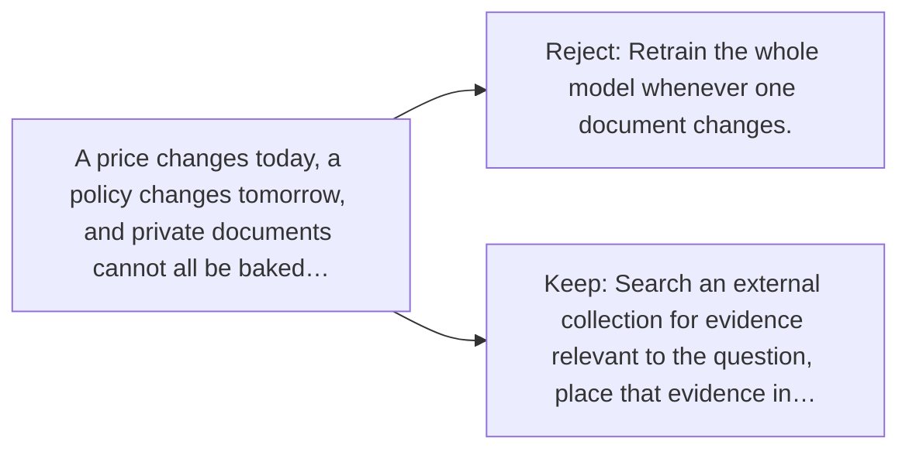

# Diagram — Excavation 054 — Retrieval-Augmented Generation — Let the Model Look Before It Speaks

The picture carries this excavation's particular counterexample and repair.



```text
TRY     Retrain the whole model whenever one document changes.
BREAK   A price changes today, a policy changes tomorrow, and private documents cannot all be baked…
REPAIR  Search an external collection for evidence relevant to the question, place that evidence in…
```

<!-- memory-film-v1:start -->
## Five-frame memory film

```text
QUESTION       What fails if we retrain the whole model whenever one document changes?
     ↓
OBJECT         the retrieval-augmented generation thread mounted on the listening table
     ↓
VISIBLE BREAK  The thread follows the tempting path—retrain the whole model whenever one document changes. Then the evidence answers: a price changes today, a policy changes tomorrow, and private documents cannot all be baked into public weights. Retraining is slow and still hides the source.
     ↓
TRANSFORMATION The public archivist changes one moving part. The thread can now search an external collection for evidence relevant to the question, place that evidence in context, and generate an answer grounded in what was retrieved.
     ↓
MEMORY SEAL    Retrieval-Augmented Generation keeps the missing power: search an external collection for evidence relevant to the question, place that evidence in context, and generate an answer grounded in what was retrieved.
```
<!-- memory-film-v1:end -->
