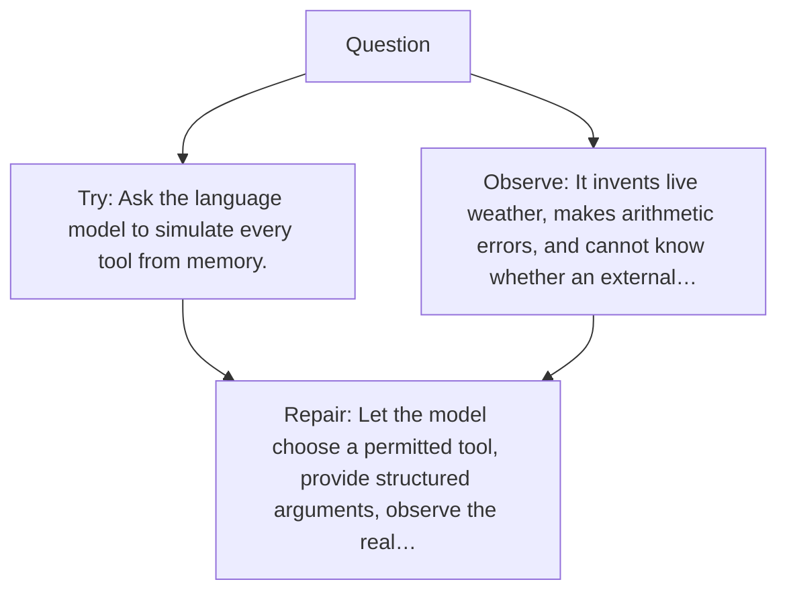

# Diagram — Excavation 055 — Tool-Using Agents — When Words Must Cause Verified Actions

The picture carries this excavation's particular counterexample and repair.



```text
TRY     Ask the language model to simulate every tool from memory.
BREAK   It invents live weather, makes arithmetic errors, and cannot know whether an external…
REPAIR  Let the model choose a permitted tool, provide structured arguments, observe the real…
```

<!-- memory-film-v1:start -->
## Five-frame memory film

```text
QUESTION       When Words Must Cause Verified Actions?
     ↓
OBJECT         the tool-using agents mirror mounted on the listening table
     ↓
VISIBLE BREAK  The mirror follows the tempting path—ask the language model to simulate every tool from memory. Then the evidence answers: it invents live weather, makes arithmetic errors, and cannot know whether an external action succeeded.
     ↓
TRANSFORMATION The public archivist changes one moving part. The mirror can now let the model choose a permitted tool, provide structured arguments, observe the real result, and decide the next step under explicit limits.
     ↓
MEMORY SEAL    Tool-Using Agents keeps the missing power: let the model choose a permitted tool, provide structured arguments, observe the real result, and decide the next step under explicit limits.
```
<!-- memory-film-v1:end -->
