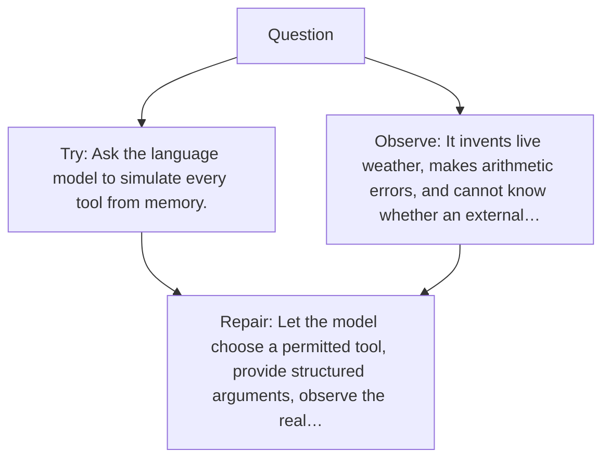

# Diagram — Excavation 055 — Tool-Using Agents — When Words Must Cause Verified Actions

The picture carries this excavation's particular counterexample and repair.



```text
TRY     Ask the language model to simulate every tool from memory.
BREAK   It invents live weather, makes arithmetic errors, and cannot know whether an external…
REPAIR  Let the model choose a permitted tool, provide structured arguments, observe the real…
```
