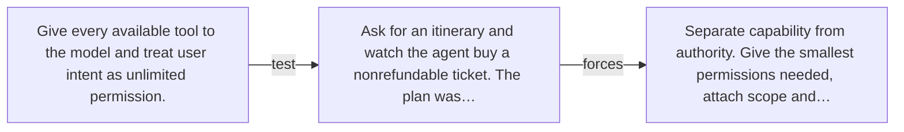

# Diagram — Excavation 056 — Authority — What Is the Agent Allowed to Do?

The picture carries this excavation's particular counterexample and repair.



```text
TRY     Give every available tool to the model and treat user intent as unlimited permission.
BREAK   Ask for an itinerary and watch the agent buy a nonrefundable ticket. The plan was…
REPAIR  Separate capability from authority. Give the smallest permissions needed, attach scope and…
```

<!-- memory-film-v1:start -->
## Five-frame memory film

```text
QUESTION       What Is the Agent Allowed to Do?
     ↓
OBJECT         the authority bell mounted on the iron threshold
     ↓
VISIBLE BREAK  The bell follows the tempting path—give every available tool to the model and treat user intent as unlimited permission. Then the evidence answers: ask for an itinerary and watch the agent buy a nonrefundable ticket. The plan was requested; the purchase was not.
     ↓
TRANSFORMATION The gatekeeper changes one moving part. The bell can now separate capability from authority. Give the smallest permissions needed, attach scope and limits, and require confirmation before consequential actions.
     ↓
MEMORY SEAL    Authority keeps the missing power: separate capability from authority. Give the smallest permissions needed, attach scope and limits, and require confirmation before consequential actions.
```
<!-- memory-film-v1:end -->
