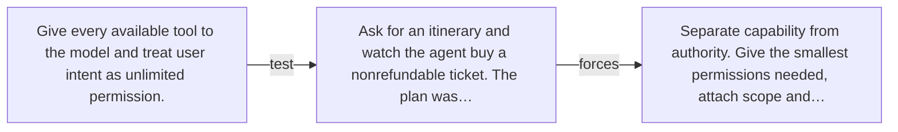

# Diagram — Excavation 056 — Authority — What Is the Agent Allowed to Do?

The picture carries this excavation's particular counterexample and repair.



```text
TRY     Give every available tool to the model and treat user intent as unlimited permission.
BREAK   Ask for an itinerary and watch the agent buy a nonrefundable ticket. The plan was…
REPAIR  Separate capability from authority. Give the smallest permissions needed, attach scope and…
```
