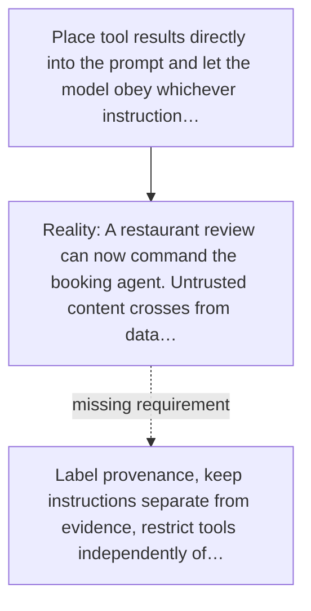

# Diagram — Excavation 057 — Prompt Injection — When Evidence Tries to Become an Instruction

The picture carries this excavation's particular counterexample and repair.



```text
TRY     Place tool results directly into the prompt and let the model obey whichever instruction…
BREAK   A restaurant review can now command the booking agent. Untrusted content crosses from data…
REPAIR  Label provenance, keep instructions separate from evidence, restrict tools independently of…
```

<!-- memory-film-v1:start -->
## Five-frame memory film

```text
QUESTION       When Evidence Tries to Become an Instruction?
     ↓
OBJECT         the prompt injection vessel mounted on the iron threshold
     ↓
VISIBLE BREAK  The vessel follows the tempting path—place tool results directly into the prompt and let the model obey whichever instruction sounds strongest. Then the evidence answers: the trouble appears immediately: a restaurant review can now command the booking agent. Untrusted content crosses from data into control.
     ↓
TRANSFORMATION The gatekeeper changes one moving part. The vessel can now label provenance, keep instructions separate from evidence, restrict tools independently of model text, and reject actions whose authority comes only from retrieved content.
     ↓
MEMORY SEAL    Prompt Injection keeps the missing power: label provenance, keep instructions separate from evidence, restrict tools independently of model text, and reject actions whose authority comes only from retrieved content.
```
<!-- memory-film-v1:end -->
