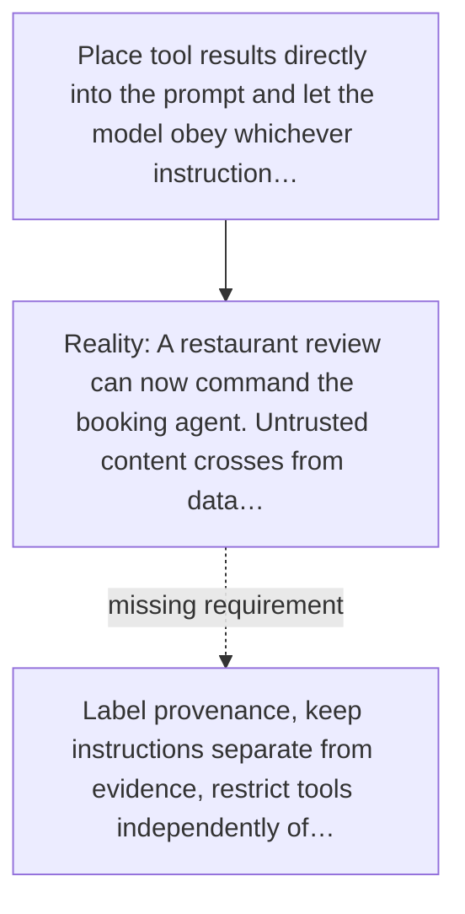

# Diagram — Excavation 057 — Prompt Injection — When Evidence Tries to Become an Instruction

The picture carries this excavation's particular counterexample and repair.



```text
TRY     Place tool results directly into the prompt and let the model obey whichever instruction…
BREAK   A restaurant review can now command the booking agent. Untrusted content crosses from data…
REPAIR  Label provenance, keep instructions separate from evidence, restrict tools independently of…
```
