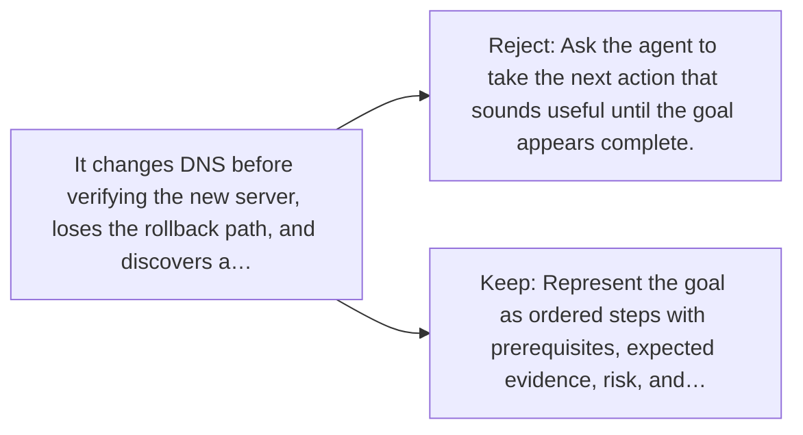

# Diagram — Excavation 058 — Planning — Turning a Goal into Checkable Steps

The picture carries this excavation's particular counterexample and repair.



```text
TRY     Ask the agent to take the next action that sounds useful until the goal appears complete.
BREAK   It changes DNS before verifying the new server, loses the rollback path, and discovers a…
REPAIR  Represent the goal as ordered steps with prerequisites, expected evidence, risk, and…
```
