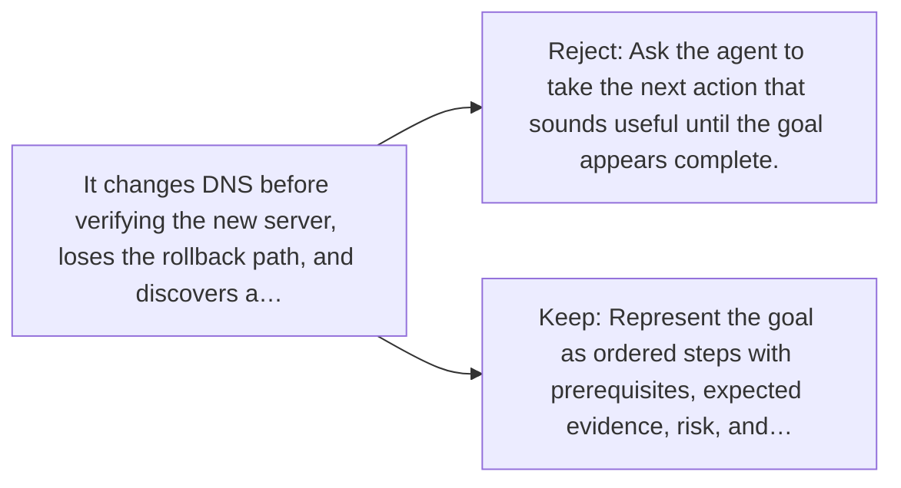

# Diagram — Excavation 058 — Planning — Turning a Goal into Checkable Steps

The picture carries this excavation's particular counterexample and repair.



```text
TRY     Ask the agent to take the next action that sounds useful until the goal appears complete.
BREAK   It changes DNS before verifying the new server, loses the rollback path, and discovers a…
REPAIR  Represent the goal as ordered steps with prerequisites, expected evidence, risk, and…
```

<!-- memory-film-v1:start -->
## Five-frame memory film

```text
QUESTION       What fails if we ask the agent to take the next action that sounds useful until the goal appears complete?
     ↓
OBJECT         the planning gate mounted on the iron threshold
     ↓
VISIBLE BREAK  The gate follows the tempting path—ask the agent to take the next action that sounds useful until the goal appears complete. Then the evidence answers: it changes DNS before verifying the new server, loses the rollback path, and discovers a missing database only after users arrive.
     ↓
TRANSFORMATION The gatekeeper changes one moving part. The gate can now represent the goal as ordered steps with prerequisites, expected evidence, risk, and rollback conditions. Re-plan when observations contradict assumptions.
     ↓
MEMORY SEAL    Planning keeps the missing power: represent the goal as ordered steps with prerequisites, expected evidence, risk, and rollback conditions. Re-plan when observations contradict assumptions.
```
<!-- memory-film-v1:end -->
