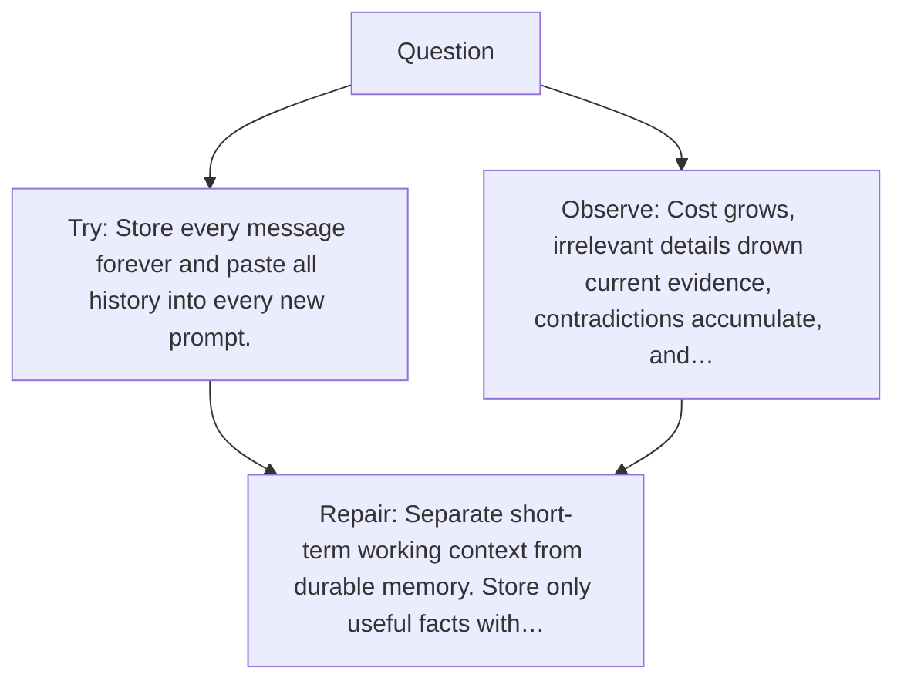

# Diagram — Excavation 059 — Memory — What Should Survive After the Context Ends?

The picture carries this excavation's particular counterexample and repair.



```text
TRY     Store every message forever and paste all history into every new prompt.
BREAK   Cost grows, irrelevant details drown current evidence, contradictions accumulate, and…
REPAIR  Separate short-term working context from durable memory. Store only useful facts with…
```
