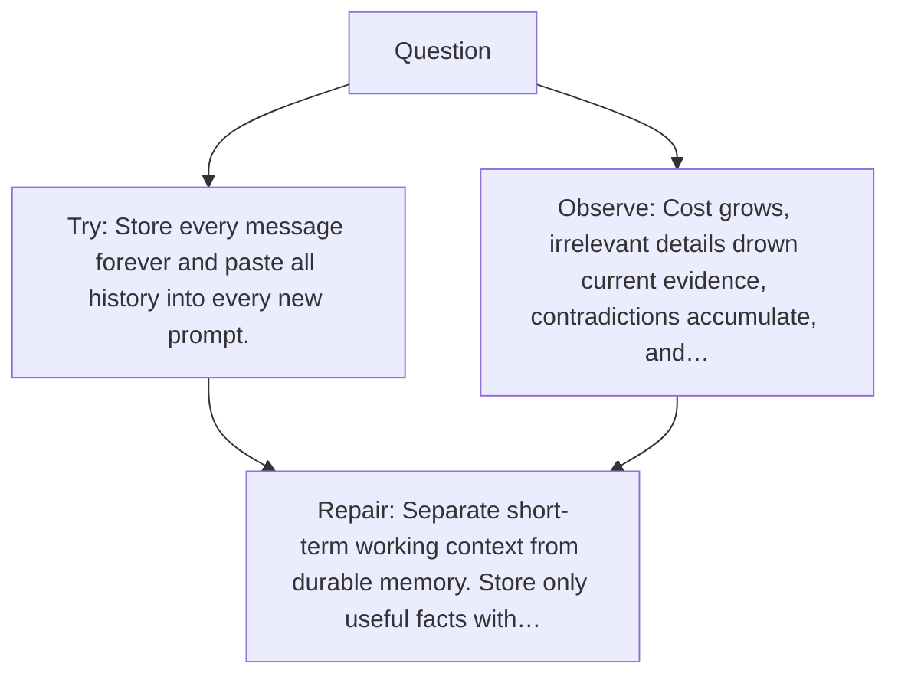

# Diagram — Excavation 059 — Memory — What Should Survive After the Context Ends?

The picture carries this excavation's particular counterexample and repair.



```text
TRY     Store every message forever and paste all history into every new prompt.
BREAK   Cost grows, irrelevant details drown current evidence, contradictions accumulate, and…
REPAIR  Separate short-term working context from durable memory. Store only useful facts with…
```

<!-- memory-film-v1:start -->
## Five-frame memory film

```text
QUESTION       What Should Survive After the Context Ends?
     ↓
OBJECT         the memory wheel mounted on the iron threshold
     ↓
VISIBLE BREAK  The wheel follows the tempting path—store every message forever and paste all history into every new prompt. Then the evidence answers: cost grows, irrelevant details drown current evidence, contradictions accumulate, and sensitive information persists without purpose.
     ↓
TRANSFORMATION The gatekeeper changes one moving part. The wheel can now separate short-term working context from durable memory. Store only useful facts with source, time, scope, and a way to update or forget them.
     ↓
MEMORY SEAL    Memory keeps the missing power: separate short-term working context from durable memory. Store only useful facts with source, time, scope, and a way to update or forget them.
```
<!-- memory-film-v1:end -->
