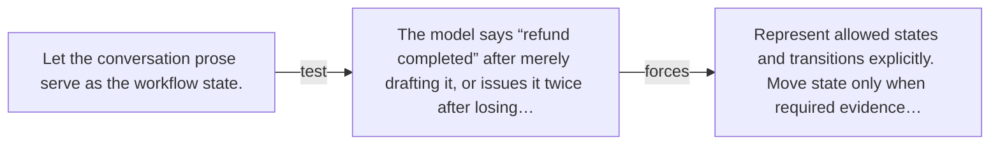

# Diagram — Excavation 060 — State Machines — Knowing What Has Actually Happened

The picture carries this excavation's particular counterexample and repair.



```text
TRY     Let the conversation prose serve as the workflow state.
BREAK   The model says “refund completed” after merely drafting it, or issues it twice after losing…
REPAIR  Represent allowed states and transitions explicitly. Move state only when required evidence…
```
