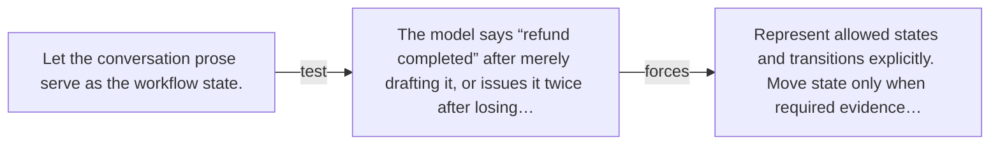

# Diagram — Excavation 060 — State Machines — Knowing What Has Actually Happened

The picture carries this excavation's particular counterexample and repair.



```text
TRY     Let the conversation prose serve as the workflow state.
BREAK   The model says “refund completed” after merely drafting it, or issues it twice after losing…
REPAIR  Represent allowed states and transitions explicitly. Move state only when required evidence…
```

<!-- memory-film-v1:start -->
## Five-frame memory film

```text
QUESTION       What fails if we let the conversation prose serve as the workflow state?
     ↓
OBJECT         the state machines map mounted on the iron threshold
     ↓
VISIBLE BREAK  The map follows the tempting path—let the conversation prose serve as the workflow state. Then the evidence answers: the model says “refund completed” after merely drafting it, or issues it twice after losing track of an earlier tool result.
     ↓
TRANSFORMATION The gatekeeper changes one moving part. The map can now represent allowed states and transitions explicitly. Move state only when required evidence arrives from the responsible system.
     ↓
MEMORY SEAL    State Machines keeps the missing power: represent allowed states and transitions explicitly. Move state only when required evidence arrives from the responsible system.
```
<!-- memory-film-v1:end -->
