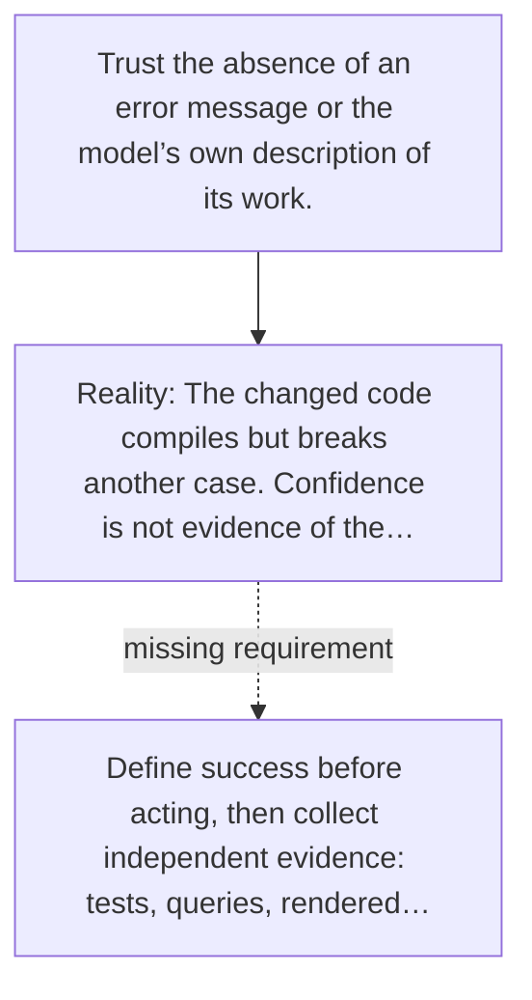

# Diagram — Excavation 061 — Verification — How Does the Agent Know It Succeeded?

The picture carries this excavation's particular counterexample and repair.



```text
TRY     Trust the absence of an error message or the model’s own description of its work.
BREAK   The changed code compiles but breaks another case. Confidence is not evidence of the…
REPAIR  Define success before acting, then collect independent evidence: tests, queries, rendered…
```

<!-- memory-film-v1:start -->
## Five-frame memory film

```text
QUESTION       How Does the Agent Know It Succeeded?
     ↓
OBJECT         the verification scale mounted on the iron threshold
     ↓
VISIBLE BREAK  The scale follows the tempting path—trust the absence of an error message or the model’s own description of its work. Then the evidence answers: the changed code compiles but breaks another case. Confidence is not evidence of the requested outcome.
     ↓
TRANSFORMATION The gatekeeper changes one moving part. The scale can now define success before acting, then collect independent evidence: tests, queries, rendered output, checksums, or user-visible state.
     ↓
MEMORY SEAL    Verification keeps the missing power: define success before acting, then collect independent evidence: tests, queries, rendered output, checksums, or user-visible state.
```
<!-- memory-film-v1:end -->
