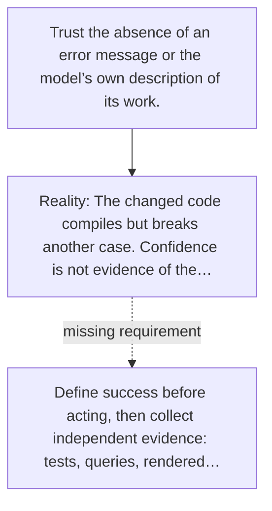

# Diagram — Excavation 061 — Verification — How Does the Agent Know It Succeeded?

The picture carries this excavation's particular counterexample and repair.



```text
TRY     Trust the absence of an error message or the model’s own description of its work.
BREAK   The changed code compiles but breaks another case. Confidence is not evidence of the…
REPAIR  Define success before acting, then collect independent evidence: tests, queries, rendered…
```
