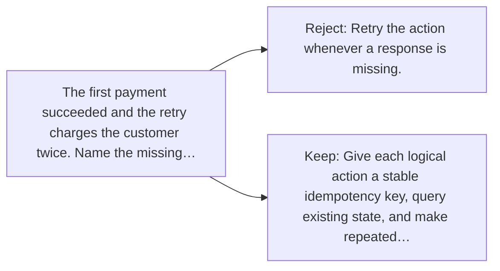

# Diagram — Excavation 062 — Retries and Idempotency — Trying Again Without Doing It Twice

The picture carries this excavation's particular counterexample and repair.



```text
TRY     Retry the action whenever a response is missing.
BREAK   The first payment succeeded and the retry charges the customer twice. Name the missing…
REPAIR  Give each logical action a stable idempotency key, query existing state, and make repeated…
```

<!-- memory-film-v1:start -->
## Five-frame memory film

```text
QUESTION       What fails if we retry the action whenever a response is missing?
     ↓
OBJECT         the retries and idempotency gear mounted on the iron threshold
     ↓
VISIBLE BREAK  The gear follows the tempting path—retry the action whenever a response is missing. Then the evidence answers: the trouble appears immediately: the first payment succeeded and the retry charges the customer twice.
     ↓
TRANSFORMATION The gatekeeper changes one moving part. The gear can now give each logical action a stable idempotency key, query existing state, and make repeated requests return the first result instead of repeating the effect.
     ↓
MEMORY SEAL    Retries and Idempotency keeps the missing power: give each logical action a stable idempotency key, query existing state, and make repeated requests return the first result instead of repeating the effect.
```
<!-- memory-film-v1:end -->
