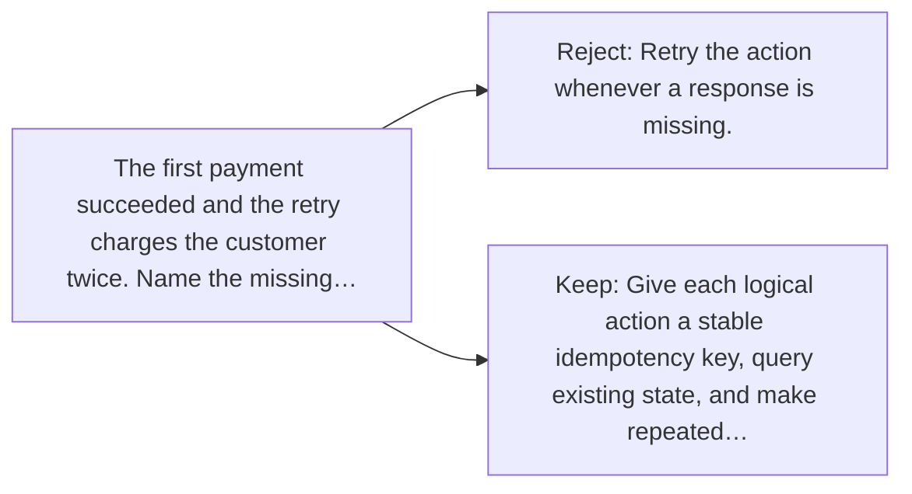

# Diagram — Excavation 062 — Retries and Idempotency — Trying Again Without Doing It Twice

The picture carries this excavation's particular counterexample and repair.



```text
TRY     Retry the action whenever a response is missing.
BREAK   The first payment succeeded and the retry charges the customer twice. Name the missing…
REPAIR  Give each logical action a stable idempotency key, query existing state, and make repeated…
```
