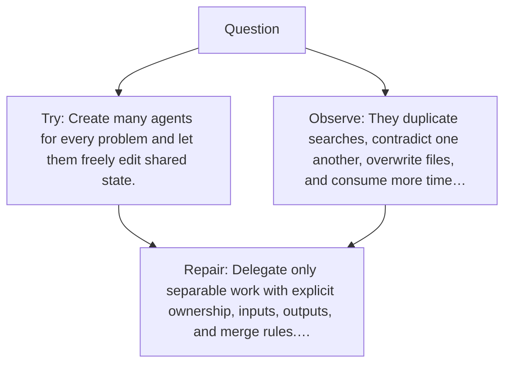

# Diagram — Excavation 063 — Multi-Agent Coordination — When Should Work Be Divided?

The picture carries this excavation's particular counterexample and repair.



```text
TRY     Create many agents for every problem and let them freely edit shared state.
BREAK   They duplicate searches, contradict one another, overwrite files, and consume more time…
REPAIR  Delegate only separable work with explicit ownership, inputs, outputs, and merge rules.…
```

<!-- memory-film-v1:start -->
## Five-frame memory film

```text
QUESTION       When Should Work Be Divided?
     ↓
OBJECT         the multi-agent coordination prism mounted on the iron threshold
     ↓
VISIBLE BREAK  The prism follows the tempting path—create many agents for every problem and let them freely edit shared state. Then the evidence answers: they duplicate searches, contradict one another, overwrite files, and consume more time coordinating than solving.
     ↓
TRANSFORMATION The gatekeeper changes one moving part. The prism can now delegate only separable work with explicit ownership, inputs, outputs, and merge rules. Keep one accountable coordinator for the final result.
     ↓
MEMORY SEAL    Multi-Agent Coordination keeps the missing power: delegate only separable work with explicit ownership, inputs, outputs, and merge rules. Keep one accountable coordinator for the final result.
```
<!-- memory-film-v1:end -->
