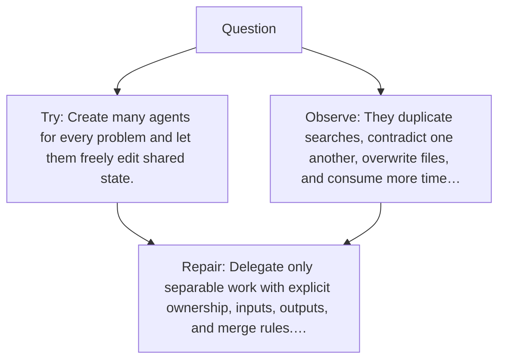

# Diagram — Excavation 063 — Multi-Agent Coordination — When Should Work Be Divided?

The picture carries this excavation's particular counterexample and repair.



```text
TRY     Create many agents for every problem and let them freely edit shared state.
BREAK   They duplicate searches, contradict one another, overwrite files, and consume more time…
REPAIR  Delegate only separable work with explicit ownership, inputs, outputs, and merge rules.…
```
