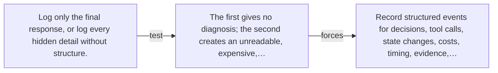

# Diagram — Excavation 064 — Observability — Seeing Why an Agent Failed

The picture carries this excavation's particular counterexample and repair.



```text
TRY     Log only the final response, or log every hidden detail without structure.
BREAK   The first gives no diagnosis; the second creates an unreadable, expensive,…
REPAIR  Record structured events for decisions, tool calls, state changes, costs, timing, evidence,…
```

<!-- memory-film-v1:start -->
## Five-frame memory film

```text
QUESTION       What fails if we log only the final response, or log every hidden detail without structure?
     ↓
OBJECT         the observability seal mounted on the iron threshold
     ↓
VISIBLE BREAK  The seal follows the tempting path—log only the final response, or log every hidden detail without structure. Then the evidence answers: the first gives no diagnosis; the second creates an unreadable, expensive, privacy-sensitive transcript.
     ↓
TRANSFORMATION The gatekeeper changes one moving part. The seal can now record structured events for decisions, tool calls, state changes, costs, timing, evidence, and outcomes while redacting sensitive content.
     ↓
MEMORY SEAL    Observability keeps the missing power: record structured events for decisions, tool calls, state changes, costs, timing, evidence, and outcomes while redacting sensitive content.
```
<!-- memory-film-v1:end -->
