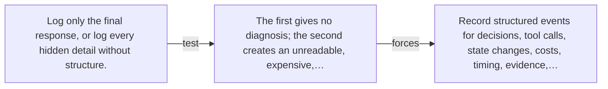

# Diagram — Excavation 064 — Observability — Seeing Why an Agent Failed

The picture carries this excavation's particular counterexample and repair.



```text
TRY     Log only the final response, or log every hidden detail without structure.
BREAK   The first gives no diagnosis; the second creates an unreadable, expensive,…
REPAIR  Record structured events for decisions, tool calls, state changes, costs, timing, evidence,…
```
