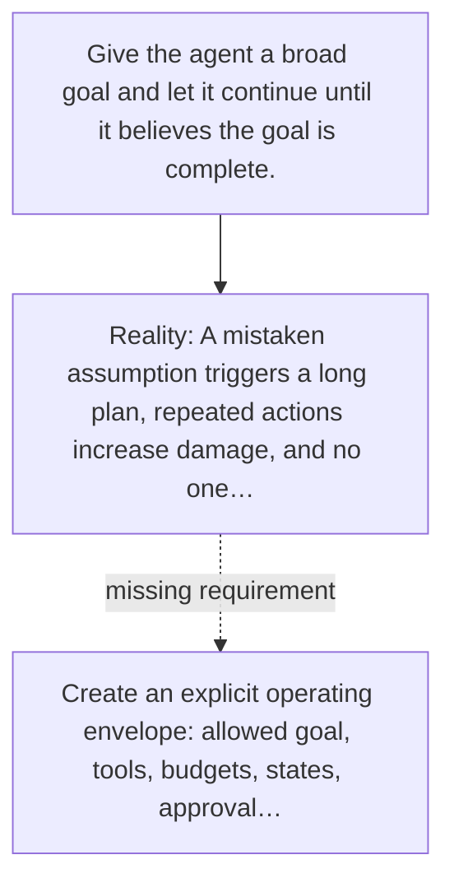

# Diagram — Excavation 065 — Bounded Autonomy — Building an Agent That Can Be Trusted

The picture carries this excavation's particular counterexample and repair.



```text
TRY     Give the agent a broad goal and let it continue until it believes the goal is complete.
BREAK   A mistaken assumption triggers a long plan, repeated actions increase damage, and no one…
REPAIR  Create an explicit operating envelope: allowed goal, tools, budgets, states, approval…
```
