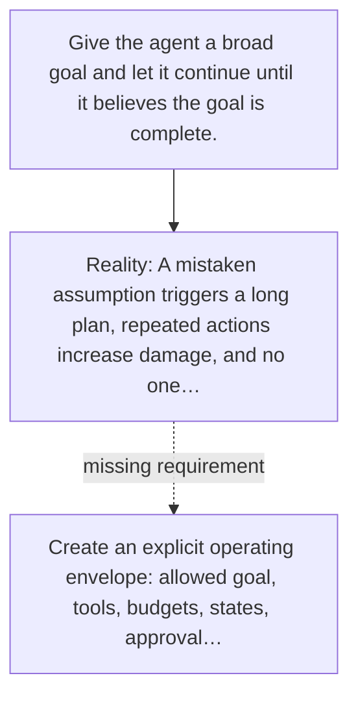

# Diagram — Excavation 065 — Bounded Autonomy — Building an Agent That Can Be Trusted

The picture carries this excavation's particular counterexample and repair.



```text
TRY     Give the agent a broad goal and let it continue until it believes the goal is complete.
BREAK   A mistaken assumption triggers a long plan, repeated actions increase damage, and no one…
REPAIR  Create an explicit operating envelope: allowed goal, tools, budgets, states, approval…
```

<!-- memory-film-v1:start -->
## Five-frame memory film

```text
QUESTION       What fails if we give the agent a broad goal and let it continue until it believes the goal is complete?
     ↓
OBJECT         the bounded autonomy lens mounted on the iron threshold
     ↓
VISIBLE BREAK  The lens follows the tempting path—give the agent a broad goal and let it continue until it believes the goal is complete. Then the evidence answers: a mistaken assumption triggers a long plan, repeated actions increase damage, and no one notices until after an irreversible step.
     ↓
TRANSFORMATION The gatekeeper changes one moving part. The lens can now create an explicit operating envelope: allowed goal, tools, budgets, states, approval gates, verification requirements, stop conditions, and escalation path.
     ↓
MEMORY SEAL    Bounded Autonomy keeps the missing power: create an explicit operating envelope: allowed goal, tools, budgets, states, approval gates, verification requirements, stop conditions, and escalation path.
```
<!-- memory-film-v1:end -->
