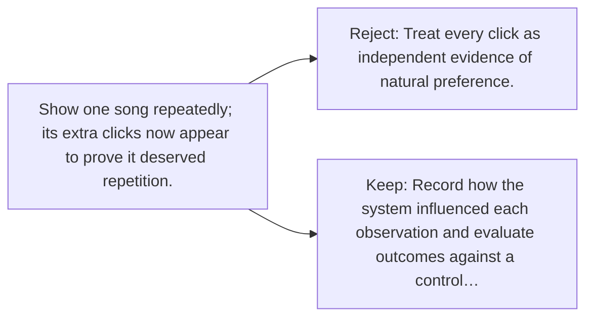

# Diagram — Excavation 066 — Feedback Loops

The picture carries this excavation's particular counterexample and repair.



```text
TRY     Treat every click as independent evidence of natural preference.
BREAK   Show one song repeatedly; its extra clicks now appear to prove it deserved repetition.
REPAIR  Record how the system influenced each observation and evaluate outcomes against a control…
```

<!-- memory-film-v1:start -->
## Five-frame memory film

```text
QUESTION       What fails if we treat every click as independent evidence of natural preference?
     ↓
OBJECT         the feedback loops key mounted on the weathered observation slate
     ↓
VISIBLE BREAK  The key follows the tempting path—treat every click as independent evidence of natural preference. Then the evidence answers: show one song repeatedly; its extra clicks now appear to prove it deserved repetition.
     ↓
TRANSFORMATION The field naturalist changes one moving part. The key can now record how the system influenced each observation and evaluate outcomes against a control or exploration policy.
     ↓
MEMORY SEAL    Feedback Loops keeps the missing power: record how the system influenced each observation and evaluate outcomes against a control or exploration policy.
```
<!-- memory-film-v1:end -->
